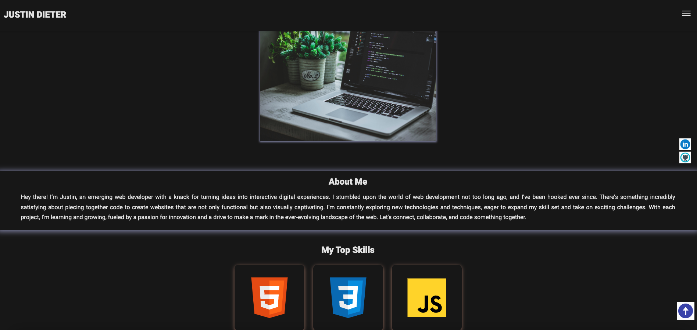

# Developer Portfolio

## Table of Contents

- [About](#about)
- [Features](#features)
- [License](#license)

## About

FreeCodeCamp Developer Portfolio Project is a comprehensive platform designed for developers to showcase their coding projects and skills. It provides a professional space to display accomplishments, connect with potential employers, and contribute to the developer community.

## Features

- Modern and professional design
- Responsive layout for mobile and desktop devices
- Sections for showcasing projects, skills, experience, and contact information
- Smooth scrolling navigation
- Interactive animations and effects

## License

This project is licensed under the MIT License.

## Acknowledgements

Special thanks to FreeCodeCamp for providing the tutorial on building a developer portfolio website.
